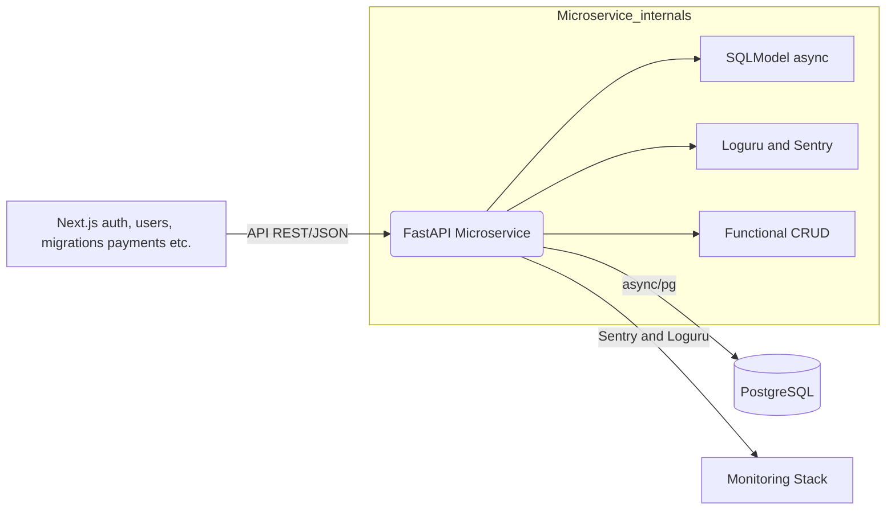

# FastAPI Backend Microservice

## 1  Purpose & Scope

* **Single responsibility** – This service only exposes data CRUD + domain logic that a separate **Next.js monorepo** ("app‑web") consumes.  All user‑facing concerns—auth, UI, payments, migrations—remain in that monorepo.
* **Schema source of truth** – Prisma migrations live in the Next.js repo.  Here we **reflect** the schema with `sqlacodegen`; we never mutate it.
* **Stateless HTTP API** – No local background workers—just pure async endpoints.  Horizontal scaling & concurrency are left to the hosting layer chosen later.

## 2  High‑level Architecture



**Key design choices**

| Area       | Decision                           | Rationale                                                                     |
| ---------- | ---------------------------------- | ----------------------------------------------------------------------------- |
| ORM        | **SQLModel**                       | Dataclass‑like syntax + async support; read‑only vs Prisma migrations.        |
| Logging    | **loguru**                         | Structured JSON & nice local format; Sentry integrates via LoguruIntegration. |
| CRUD layer | Functional helpers (`app/crud.py`) | Keeps business rules pure & easy to unit‑test.                                |

## 3  Repository Map

| Path            | Description                                                   |
| --------------- | ------------------------------------------------------------- |
| `app/api/*`     | Versioned route modules (`pages`, `utils`, `private`).        |
| `app/core/`     | Settings, DB engine, logging bootstrap.                       |
| `app/models.py` | **Autogenerated** SQLModel tables – do **not** edit manually. |
| `app/main.py`   | FastAPI factory & lifespan hooks.                             |
| `Makefile`      | Canonical dev workflow (`check`, `test`, `run`, `orm`).       |
| `Dockerfile`    | Minimal production image that installs deps with **uv**.      |

## 4  Getting Started (Local Dev)

```bash
# 1.  Move into backend directory of the monorepo
cd backend

# 2.  Copy env template and edit
cp .env.example .env  # set DATABASE_URL, SECRET_KEY, etc.

# 3.  Install Python dependencies (and dev tools)
uv sync --dev  # respects locked versions in uv.lock

# 4.  Ensure Postgres is reachable
#     (e.g. Docker, local service, remote—your call)
#     DATABASE_URL must point to it before continuing.

# 5.  Run the API with hot‑reload
make run  # -> uv run uvicorn app.main:app --reload
```

### One‑shot Docker Compose (optional)

A full local stack—including Postgres—can be started with:

```bash
docker compose up --build
```

The override file automatically enables live‑reload and single‑process mode for development convenience.

## 5  Environment Variables (excerpt)

| Var                    | Required | Notes                                                             |
| ---------------------- | -------- | ----------------------------------------------------------------- |
| `ENVIRONMENT`          | ✓        | `local`, `staging`, `production` – toggles diagnostics routes.    |
| `SECRET_KEY`           | ✓        | Must **not** be `changethis` outside local; validated at startup. |
| `DATABASE_URL`         | ✓        | Postgres connection string – Prisma owns schema.                  |
| `BACKEND_CORS_ORIGINS` |          | JSON array of allowed origins.                                    |
| `SENTRY_DSN`           |          | Activates Sentry integration (optional).                          |

## 6  ORM Regeneration Workflow

When Prisma migrations change the schema, regenerate SQLModel files so type‑checking stays green:

```bash
make orm          # composite target below
make models       # tables → app/models.py
make view-models  # views  → app/view_tables.py (if any)
```

The Makefile pulls `DATABASE_URL` from `.env`, runs `sqlacodegen`, and overwrites files in‑place.  CI will fail if regenerated code isn’t committed.

## 7  Testing & Quality Gates

```bash
make check          # pyright → ruff‑fix → ruff‑lint
make test MODE=full # full pytest + coverage run
make smoke           # import‑only startup check
```

The `conftest.py` harness spins up an **SQLite in‑file** DB; it never touches your real Postgres instance.

## 8  Endpoints Primer (v1)

```
GET  /api/v1/utils/health-check   → {"status": true}
GET  /api/v1/pages/               → paginated Page list
GET  /api/v1/pages/{id}           → single Page
POST /api/v1/pages/               → create Page
PUT  /api/v1/pages/{id}           → update Page
DEL  /api/v1/pages/{id}           → delete Page

# Local‑only diagnostics (ENVIRONMENT=local)
GET  /api/v1/private/diagnostics/server
GET  /api/v1/private/diagnostics/database
```
